# Agent HQ Diagram Sources

Status: Canonical repository source
Owner: Agent HQ architecture
Last reviewed: 2026-08-23

These Mermaid definitions are the version-controlled source for the rendered diagrams in the canonical Google Docs.

## Editing and rendering rules

1. Edit the Mermaid definition here first.
2. Render and inspect the diagram before replacing the image in its owning document.
3. Keep the heading aligned with the owning Google Doc and figure purpose.
4. Do not hand-edit rendered diagram images.
5. Cross-repository definitions owned by the Control Plane remain in that repository's companion diagram-source file.

## Agent HQ PRD: Product Architecture

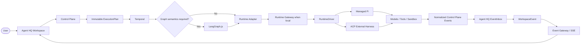

## System Architecture Overview

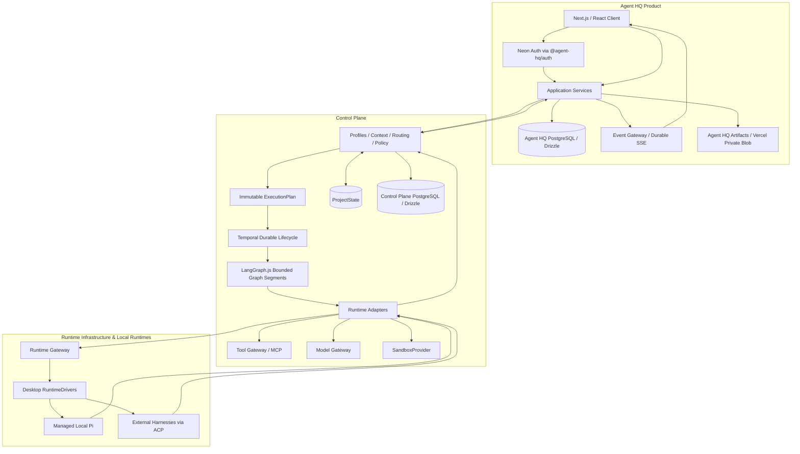

## Agent HQ TDD: Application Architecture

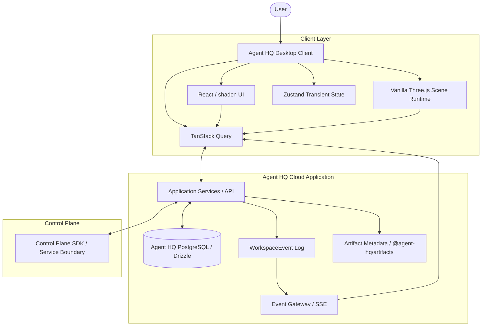

## Agent HQ TDD: Real-Time Event Flow

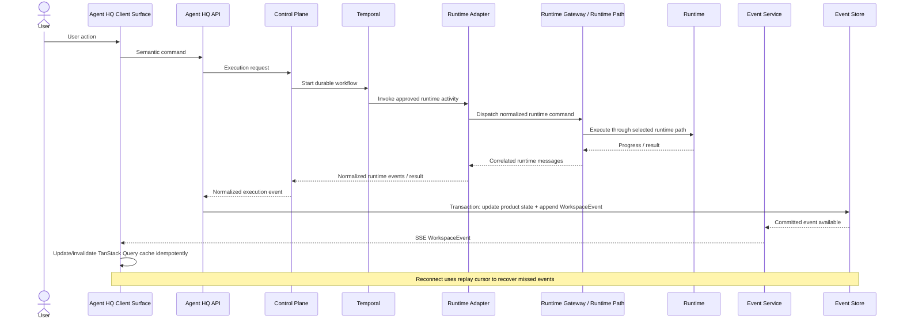

## Security & Trust Model: Trust Boundaries

```mermaid
flowchart LR
    U([User]) --> B[Browser / Agent HQ Client]
    subgraph AppCloud["Agent HQ Application Trust Zone"]
        AUTH["Neon Auth<br/>via @agent-hq/auth"]
        API[Agent HQ API]
        DB[(Agent HQ PostgreSQL / Drizzle)]
        EG[Event Gateway]
        ART[@agent-hq/artifacts]
        BLOB[(Vercel Private Blob)]
    end
    subgraph ControlCloud["Control Plane Trust Zone"]
        CP[Control Plane]
        CDB[(Control Plane PostgreSQL / Drizzle)]
        SEC[(KMS / Secrets / Credential Leases)]
        RG[Runtime Gateway]
        TG[Tool Gateway / PolicyDecisionPoint]
        MG[Model Gateway]
        SB[SandboxProvider]
    end
    subgraph Local["User Device Trust Zone"]
        RH[Desktop Local Runtime Host]
        MP[Managed Local Pi]
        EH[External Harnesses]
    end
    subgraph External["External Provider / Connector Trust Zone"]
        PR[Models / Tools / Connectors / Sandbox Provider]
    end
    B --> AUTH
    AUTH --> API
    API --> DB
    API --> EG
    EG --> B
    API --> ART
    ART --> BLOB
    API --> CP
    CP --> CDB
    CP --> SEC
    CP --> RG
    CP --> TG
    CP --> MG
    CP --> SB
    RG <-->|Outbound authenticated runtime channel| RH
    RH --> MP
    RH --> EH
    MP --> PR
    EH --> PR
    TG --> PR
    MG --> PR
    SB --> PR
```

## Data Model & API: Domain Relationships

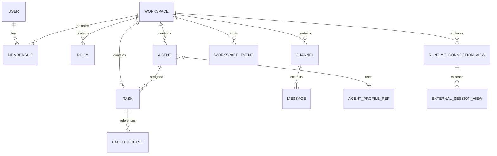

## Data Model & API: Task and Execution State Machines

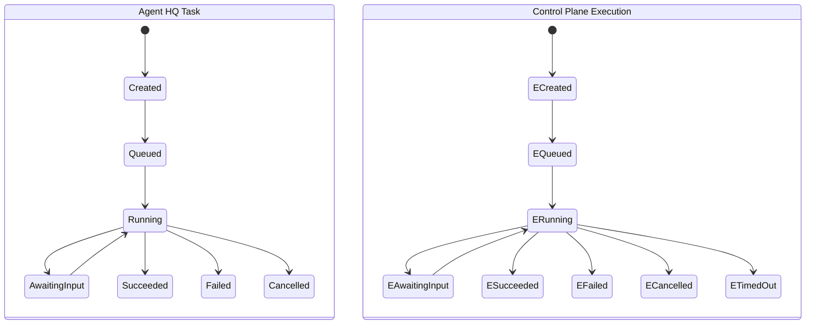

## Nifty League Partnership: Product Boundary

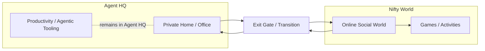

## Nifty League Partnership: Cross-Product Handoff

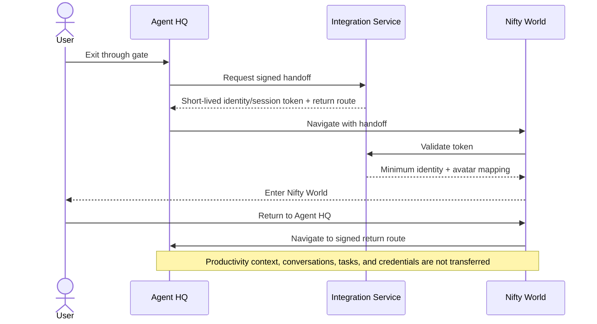

## Desktop-First Runtime Topology

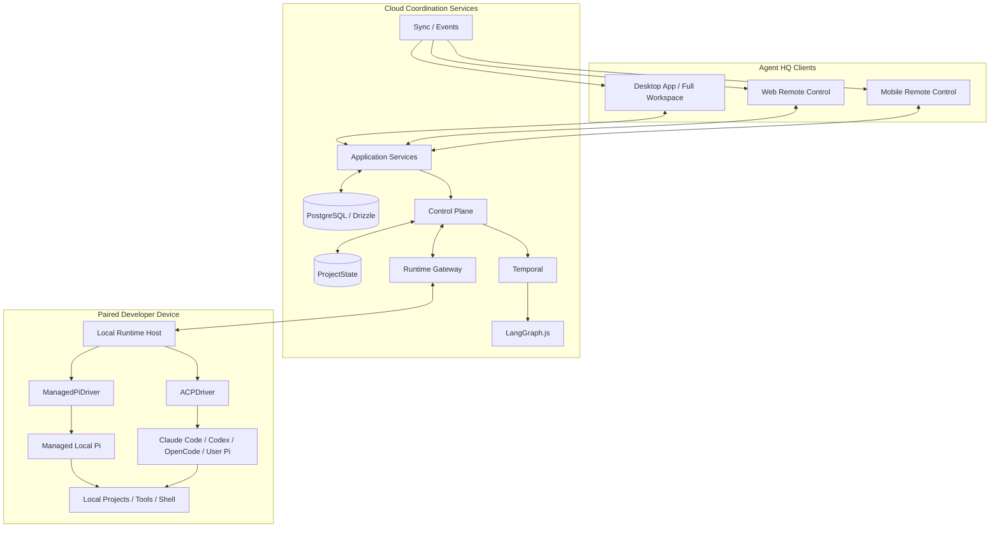

## Later Cloud Workforce Topology

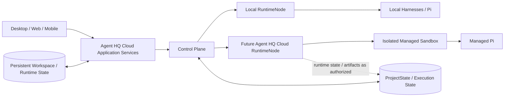

## Identity and Principal Mapping

```mermaid
flowchart LR
    AUTH[Neon Auth] --> AB[@agent-hq/auth]
    AB --> AI[(AuthIdentity)]
    AI --> U[(Stable Agent HQ User)]
    U --> UP[User PrincipalRef]
    UP --> MEM[Workspace Membership and Permissions]
    DS[Desktop App Session] --> UP
    RN[(RuntimeNode Registration)] --> DP[Device PrincipalRef]
    CP[Control Plane Service] --> SP[Service PrincipalRef]
    AG[Persistent Agent] --> AP[Agent PrincipalRef]
    WK[Worker] --> WP[Worker PrincipalRef]
    DP -. separate credential lifecycle .- DS
    SP -. separate credential lifecycle .- UP
```

## Desktop Authentication Boundary

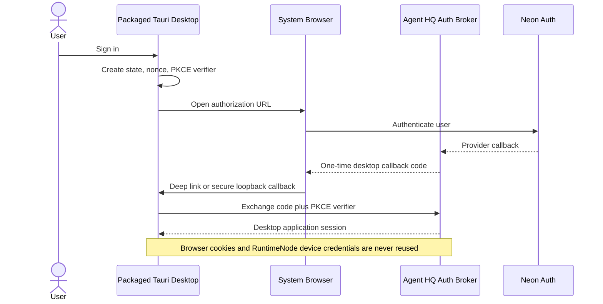

## RuntimeNode Ownership and Command Channel

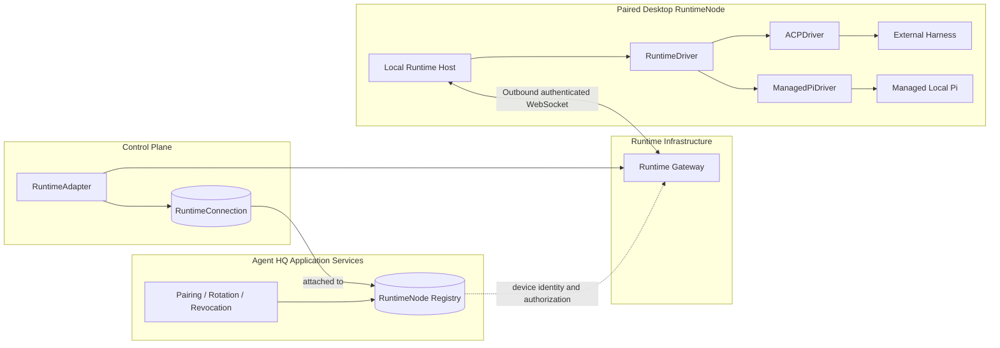

## Cross-Service Command and Event Consistency

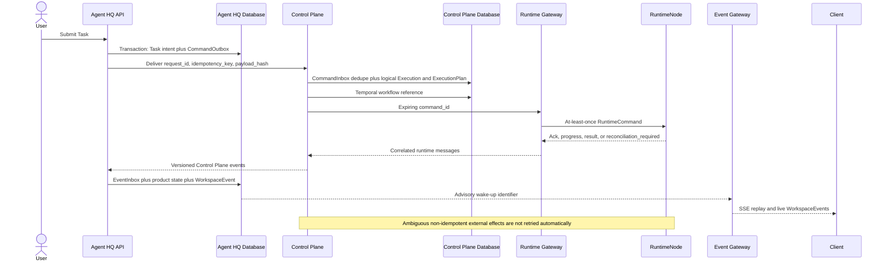

## LocalProjectGrant and Context Promotion

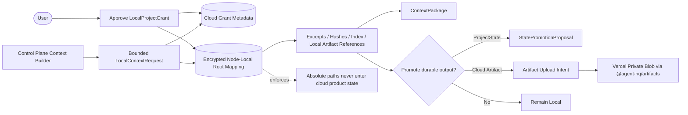

## Artifact Storage and Lifecycle

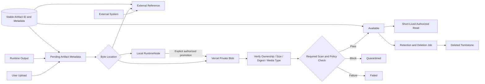

## Event Gateway Horizontal Scale and Replay

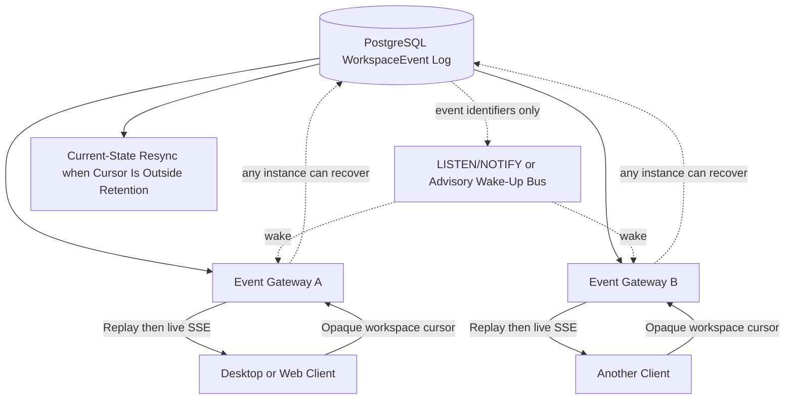
