# Agent HQ Diagram Sources

Status: Canonical repository source
Owner: Agent HQ architecture
Last reviewed: 2026-08-28

These Mermaid definitions are the version-controlled Agent HQ source for the rendered diagrams cataloged in the canonical Google Docs. Cross-repository Control Plane and Cortana diagrams remain in their owning repositories.

## Editing and rendering rules

1. Edit the owning Mermaid definition first.
2. Render and inspect the diagram before replacing the image in its owning Google Doc.
3. Keep headings aligned with the owning document and figure purpose.
4. Do not hand-edit rendered diagram images.
5. Physical provider resource names such as R2 bucket names, Wrangler bindings, Neon project IDs, and Railway project IDs are deployment configuration, not domain identifiers.
6. Agent HQ and Control Plane may share a Cloudflare account/provider, but they use separate bucket/credential authority. The Control Plane `ctrl-plane` bucket is not Agent HQ Artifact storage.

## Agent HQ PRD: Product Architecture

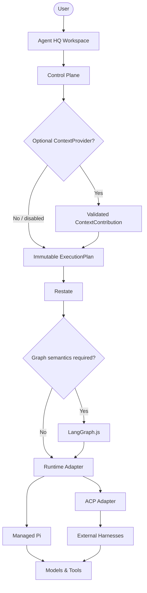

## System Architecture Overview

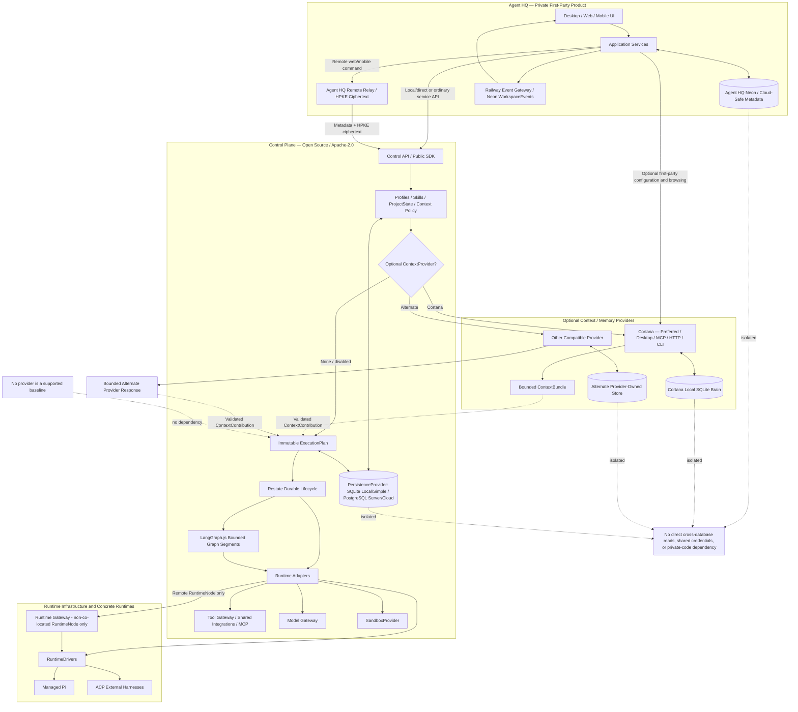

## Agent HQ TDD: Application Architecture

```mermaid
flowchart TB
    U([User]) --> CL[Agent HQ Desktop Client]
    subgraph Client["Client Layer"]
        CL --> S[Agent Sim engine remote (entitlement-gated)]
        CL --> L[Channel / List View]
        CL --> UI[Task, Chat, Kanban, Settings]
        CL --> EC[Event Client]
    end
    subgraph App["Agent HQ Application Services"]
        AUTH["Neon Auth<br/>via @agent-hq/auth"]
        API[API]
        WS[Workspace / Agent / Task / Conversation Metadata Services]
        RELAY[Remote Control Relay / HPKE]
        EV[Railway Event Gateway]
        DB[(Neon / Drizzle Cloud Metadata)]
    end
    CL --> AUTH
    CL <--> LC[(Encrypted Local Content / rusqlite)]
    AUTH --> API
    API --> WS
    WS --> DB
    CL -->|Local direct| CP[Local Control Plane]
    API --> RELAY
    RELAY -->|Remote metadata + HPKE ciphertext| CP
    CP --> API
    WS --> EV
    EV --> EC
```

## Agent HQ TDD: Remote-Origin Product Event Flow

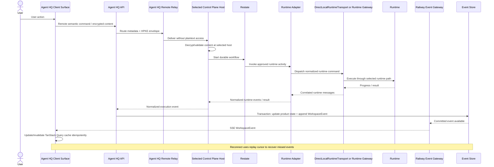

## Security & Trust Model: Trust Boundaries

```mermaid
flowchart LR
    U([User]) --> B[Browser / Agent HQ Client]
    subgraph AppCloud["Agent HQ Application Trust Zone"]
        AUTH["Neon Auth<br/>via @agent-hq/auth"]
        API[Agent HQ API]
        DB[(Agent HQ Neon / Cloud-Safe Metadata)]
        RELAY[Remote Relay / HPKE Ciphertext]
        EG[Railway Event Gateway]
        ART[@agent-hq/artifacts]
        BLOB[(Agent HQ Cloudflare R2 - separate product bucket)]
    end
    subgraph Control["Selected Control Plane Trust Zone - local, self-hosted, or managed cloud"]
        CP[Control Plane]
        CDB[(Control Plane SQLite local / PostgreSQL server)]
        SEC[(OS Secure Storage / Managed Secrets / Credential Leases)]
        RG[Runtime Gateway - non-co-located RuntimeNode only]
        TG[Tool Gateway / PolicyDecisionPoint]
        CG[ContextProvider Registry / Policy / Adapters]
        MG[Model Gateway]
        SB[SandboxProvider]
    end
    subgraph Local["User Device Trust Zone"]
        LC[(Encrypted Agent HQ Local Content)]
        RH[Desktop Local Runtime Host]
        MP[Managed Local Pi]
        EH[External Harnesses]
        CT[Cortana / Local Context Provider]
    end
    subgraph External["External Provider / Connector Trust Zone"]
        PR[Models / Tools / Connectors / Sandbox Provider]
        XP[Remote Context / Memory Provider]
    end
    B --> AUTH
    AUTH --> API
    API --> DB
    API --> EG
    EG --> B
    API --> ART
    ART --> BLOB
    API -->|Cloud-safe service calls| CP
    API --> RELAY
    RELAY -->|Remote product command / HPKE| CP
    CP --> CDB
    CP --> SEC
    CP -->|Non-co-located RuntimeNode only| RG
    CP --> TG
    CP --> CG
    CP --> MG
    CP --> SB
    RG <-->|Outbound authenticated runtime channel| RH
    RH --> MP
    RH --> EH
    RH --> CT
    MP --> PR
    EH --> PR
    TG --> PR
    MG --> PR
    SB --> PR
    CG -->|Non-co-located provider request| XP
    CG -->|Co-located provider request| RH
```

## Data Model & API: Domain Relationships

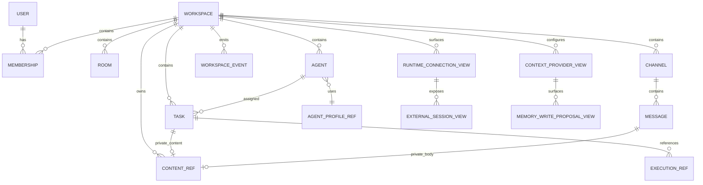

## Data Model & API: Task and Execution State Machines

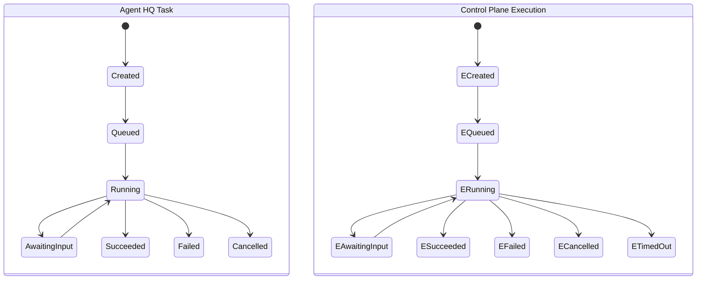

## Nifty League Partnership: Product Boundary

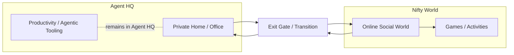

## Nifty League Partnership: Cross-Product Handoff

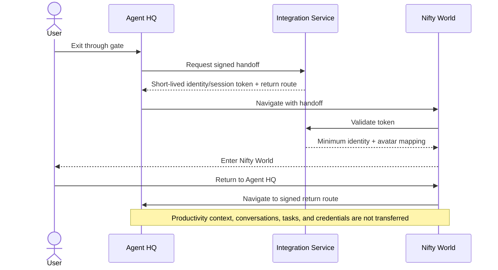

## MVP Local-First and Self-Hosted Runtime Topology

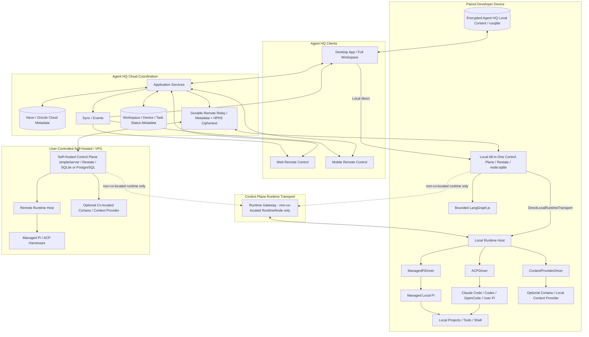

## Consumer Managed-Cloud Execution Topology

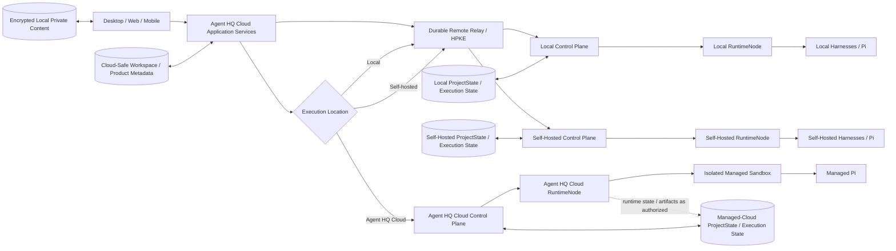

## Identity and Principal Mapping

```mermaid
flowchart LR
    AUTH[Neon Auth] --> AB[@agent-hq/auth]
    AB --> AI[(AuthIdentity)]
    AI --> U[(Stable Agent HQ User)]
    U --> UP[User PrincipalRef]
    UP --> MEM[Workspace Membership and Permissions]
    DS[Desktop App Session] --> UP
    RN[(RuntimeNode Registration)] --> DP[Device PrincipalRef]
    CP[Control Plane Service] --> SP[Service PrincipalRef]
    AG[Persistent Agent] --> AP[Agent PrincipalRef]
    WK[Worker] --> WP[Worker PrincipalRef]
    DP -. separate credential lifecycle .- DS
    SP -. separate credential lifecycle .- UP
```

## Desktop Authentication Boundary

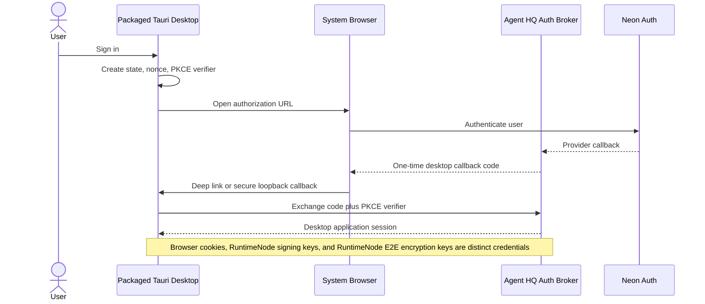

## RuntimeNode Ownership and Command Channel

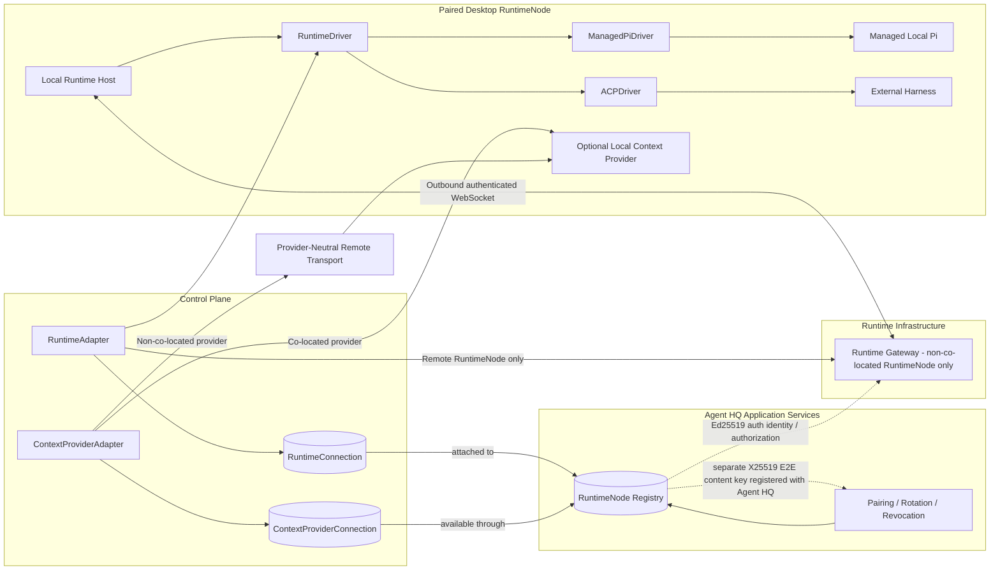

## Remote-Origin Cross-Service Command and Event Consistency

```mermaid
sequenceDiagram
    actor U as User
    participant A as Agent HQ API
    participant X as Agent HQ Remote Relay
    participant AD as Agent HQ Database
    participant P as Selected Control Plane Host
    participant CD as Control Plane Database
    participant G as DirectLocalRuntimeTransport or Runtime Gateway
    participant N as RuntimeNode
    participant E as Railway Event Gateway
    participant C as Client
    U->>A: Submit Task
    A->>AD: Transaction: cloud-safe Task metadata + CommandOutbox/ciphertext ref
    A->>X: Route request metadata + HPKE envelope
    X->>P: Deliver request_id/idempotency/payload_hash + ciphertext
    P->>P: Endpoint decrypt + scope/schema validation
    P->>CD: CommandInbox dedupe plus logical Execution and ExecutionPlan
    P->>CD: Restate workflow / invocation reference
    P->>G: Expiring command_id over selected local/remote transport
    G->>N: At-least-once RuntimeCommand
    N-->>G: Ack, progress, result, or reconciliation_required
    G-->>P: Correlated runtime messages
    P-->>A: Versioned Control Plane events
    A->>AD: EventInbox plus product state plus WorkspaceEvent
    AD-->>E: Advisory wake-up identifier
    E-->>C: SSE replay and live WorkspaceEvents
    Note over P,N: Remote-origin example; local desktop may submit the same versioned/idempotent contract directly to local Control Plane. Ambiguous non-idempotent external effects are not retried automatically
```

## LocalProjectGrant and Context Promotion

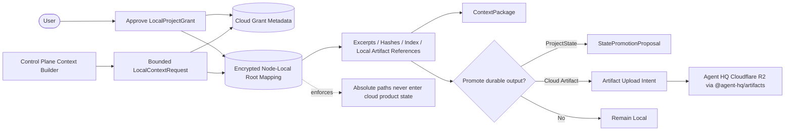

## Artifact Storage and Lifecycle

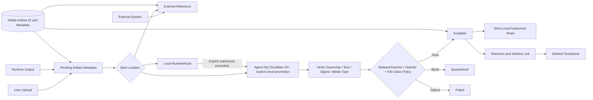

## Event Gateway Horizontal Scale and Replay

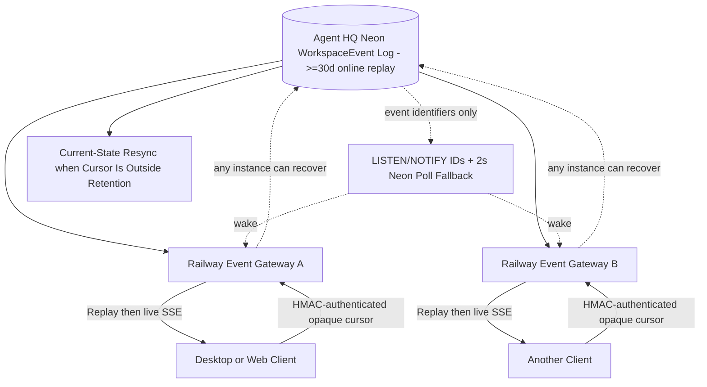
