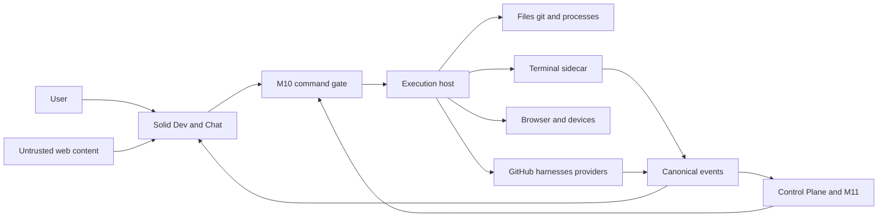

# Dev View threat model

- Status: M12 design threat model; controls marked **required** are not existing
  implementation until their tests land.
- Scope: [ADR 0009](../decisions/0009-dev-view-control-plane.md),
  [Dev Runtime spec](../specs/dev-runtime.md), and the planned paths routed to
  that spec in `AGENTS.md`.
- Assumption validation: the owner requires a packaged macOS app plus authorized
  remote runtime nodes, multi-workspace isolation, private source/prompts/files,
  local credentials/cookies, and no implementation follow-up decisions. Risk is
  therefore ranked for an internet-connected, multi-tenant Control Plane whose
  execution hosts may contain valuable developer credentials.

## Executive summary

The highest risks are a browsed or remote attacker crossing into the privileged
desktop/runtime-node command channel, filesystem/worktree identity races causing
arbitrary access or deletion, and weak process/browser-profile ownership leaking
credentials or killing unrelated work. The architecture can contain these only
if M10 remains the sole authorization boundary and every side effect binds
scope, canonical identity, generation, and a fresh proof. The current generic
loopback invoke/event bridge is explicitly not sufficient.

## Scope and assumptions

In scope:

- `packages/dev-view/src/**`, `packages/types/src/dev-runtime.ts`,
  `packages/data/src/dev-runtime.ts`;
- `apps/web/src/lib/desktop-dev-runtime.ts` and the existing platform/bridge
  seams it uses;
- `apps/desktop/shell/src/dev-runtime/**` and M10/M11/runtime-node integrations;
- terminals/sidecar, project/worktree/files/git, harness sessions,
  browser/device lanes, GitHub, usage/resources, App Library, archive/cleanup;
- packaged artifact/update/provenance behavior that changes the runtime boundary.

Out of scope: generic website abuse unrelated to Dev View, donor repository
security, broad CI compromise, OS/kernel compromise, and an attacker who already
has the user's full local OS account. Those become in scope when they cross a
Dev Runtime boundary or artifact.

Assumptions:

- M10 channel/permission work is complete before privileged M12 code ships;
- TLS/authenticated Control Plane and RuntimeConnection semantics remain as
  specified by `docs/specs/runtime-nodes.md`;
- M12 certifies the packaged local macOS path and exercises remote-ready code
  through authorized fake RuntimeConnection, revocation, and scope-isolation
  fixtures; production remote-node certification belongs to M14;
- runtime nodes may be remote and intermittently disconnected once M14 enables
  that production path;
- repository, prompt, terminal, screenshot, cookie, and usage data are private;
- extension/browser content and remote GitHub text are attacker-controlled;
- users may approve destructive work, but approval does not waive identity or
  safety proofs.

Open questions are intentionally resolved fail-closed: unsupported platform
capabilities remain unavailable; no privilege is inferred while an upstream
contract is absent.

## System model

### Primary components

- **Solid client:** Dev/Chat projection and untrusted-content rendering
  (`apps/web`, planned `packages/dev-view`).
- **Platform provider:** capability seam and desktop/remote adapter
  (`packages/workspace-ui/src/platform.ts`, planned
  `apps/web/src/lib/desktop-dev-runtime.ts`).
- **M10 gate:** authenticated command/channel, capability, credential, and
  runtime-node admission (`docs/specs/runtime-nodes.md`,
  `docs/specs/local-content.md`).
- **Execution host:** planned worktree/files/git/process/browser/device adapters
  under `apps/desktop/shell/src/dev-runtime/**`.
- **Terminal sidecar:** detached PTY, bytes, checkpoints, input authority.
- **Control Plane/M11:** durable task/session/approval/event read models.
- **External systems:** git remotes/GitHub, harnesses, browser origins, device
  tools, provider usage endpoints.

### Data flows and trust boundaries

- User/browser renderer → platform provider: IDs, input, paths, prompts and
  plans over typed calls; **required:** schema/size validation and no direct
  shell/desktop import.
- Platform provider → M10 gate: authenticated command/channel; **required:**
  client identity, nonce/expiry, scope/capability/resource/generation checks.
  `apps/web/src/lib/desktop-bridge.ts` is existing plumbing, not this proof.
- Control Plane → RuntimeConnection → execution host: encrypted commands/events;
  runtime node repeats authorization and generation checks
  (`docs/specs/runtime-nodes.md`).
- Execution host → filesystem/git/process/PTY: privileged OS operations;
  **required:** canonical identity, argv, launch-record and lease proofs.
- Execution host ↔ sidecar: owner-only authenticated endpoint; **required:**
  executable/protocol/scope/session/generation proof and bounded replay.
- Harness/PTY → event reducer → Dev/Chat: native/ACP, hook, or untrusted terminal
  bytes; **required:** precedence, authentication, parser budgets, redaction.
- Browser origin/CDP/device → execution host/client: page pixels/DOM/network/input
  and cookies; **required:** separate profiles, ownership generation, SSRF and
  permission gates.
- GitHub/provider → adapter/client: untrusted text/status plus credentials;
  **required:** host-scoped vault reference, bounded parser, sanitization.
- Execution host → shared logs/events/telemetry: metadata/private content;
  **required:** classification and redaction before persistence and egress.

#### Diagram

## Assets and security objectives

| Asset                                           | Why it matters                                  | Objective |
| ----------------------------------------------- | ----------------------------------------------- | --------- |
| workspace/account/runtime-node authority        | prevents cross-tenant host control              | C/I/A     |
| source, worktrees, uncommitted/unpushed data    | user intellectual property and recoverability   | C/I/A     |
| credentials, cookies, environment secrets       | can compromise accounts and repositories        | C/I       |
| terminal/process/browser input authority        | direct code execution and authenticated actions | I/A       |
| RuntimeSession/events/approvals                 | authoritative task history and user decisions   | I/A       |
| sidecar/profile/local-content stores            | retain private bytes and durable identity       | C/I/A     |
| Git refs, PRs, checks, merges                   | supply-chain and repository integrity           | I/A       |
| screenshots, prompts, diffs, diagnostics, usage | private workspace behavior and content          | C/I       |
| packaged app/sidecar/provenance                 | code executed with local developer authority    | I/A       |

## Attacker model

### Capabilities

- control a web page loaded in an embedded/external browser lane;
- send internet traffic to exposed Control Plane surfaces and malicious remote
  runtime candidates;
- contribute malicious repository names, paths, symlinks, git filenames,
  manifests, hook output, OSC/terminal bytes, PR/check text, redirects, DNS, and
  provider responses;
- race filesystem objects, process/port reuse, reconnects, stale windows,
  duplicate requests, and crash/restart boundaries through ordinary inputs;
- persuade a user to initiate a legitimate operation on attacker-crafted data.

### Non-capabilities

- no assumed kernel, code-signing identity, or full local-user compromise;
- no assumed ability to break modern cryptography;
- no authority merely from loopback, same origin, a PID/port/path, or object ID;
- no right to bypass a clear item-specific user approval and M10 policy.

## Entry points and attack surfaces

| Surface                        | How reached                                | Boundary                             | Evidence                                                                               |
| ------------------------------ | ------------------------------------------ | ------------------------------------ | -------------------------------------------------------------------------------------- |
| desktop invoke/event bridge    | client or browsed/loopback network context | renderer → host                      | `apps/web/src/lib/desktop-bridge.ts`; `apps/desktop/shell/src/bun/index.ts`            |
| runtime-node command route     | authenticated Control Plane/remote client  | cloud → node                         | `docs/specs/runtime-nodes.md`                                                          |
| project/worktree/files/git     | selected/cloned attacker repository        | host → OS/git                        | `docs/specs/dev-runtime.md` Worktree/Files sections                                    |
| terminal sidecar/protocol      | attach/input, PTY bytes, OSC, shell hooks  | UI/harness → process                 | `docs/specs/dev-runtime.md` Terminal/Event sections                                    |
| harness ACP/native/hook        | discovered executable and run stream       | external process → canonical session | `docs/specs/dev-runtime.md` Harness section                                            |
| browser/CDP/navigation/cookies | URL, preview port, takeover/import         | web origin/profile → host            | `docs/decisions/0006-browser-lanes-and-desktop-shell.md`                               |
| computer-use lanes             | consented capture/input over the M10 gate  | agent harness → host desktop         | `docs/specs/dev-runtime.md` Computer use section                                       |
| device tools                   | simulator/ADB inventory and actions        | UI → external CLI/device             | `docs/specs/dev-runtime.md` Browser/device section                                     |
| GitHub/usage HTTP              | API host, redirect, remote text            | provider → host/UI                   | `docs/specs/dev-runtime.md` GitHub/Usage sections                                      |
| App Library/theme metadata     | catalog/install/activation                 | extension metadata → UI/host         | `packages/workspace-ui/src/plugins.ts`; `docs/specs/dev-runtime.md` Appearance section |
| logs/events/telemetry          | every subsystem                            | private host → shared store/vendor   | `docs/specs/local-content.md`; Dev Runtime redaction section                           |

## Top abuse paths

1. A malicious browsed page reaches an unauthenticated loopback invoke route,
   names a valid workspace object, and executes host filesystem/process commands.
2. A repository swaps a validated parent for a symlink before save/cleanup,
   redirecting a privileged write or deletion outside the worktree.
3. A stale cleanup/stop plan observes PID/path/port, the OS reuses it, and Adea
   signals or deletes an unrelated owner.
4. Forged OSC/hook bytes claim agent/input authority or approval completion,
   causing hidden prompt/command delivery.
5. A replayed attach/input token or stale window generation injects terminal or
   browser input after ownership transferred.
6. A browser redirect/DNS rebinding or configurable usage URL reaches metadata,
   private services, or an attacker host carrying credentials.
7. Cookie/profile crossover exposes human credentials to task automation or
   leaves a partial imported profile after cancellation.
8. Malicious PR/check/manifest text becomes a prompt, command, link, dynamic
   module, or UI injection.
9. Sidecar/app update adopts an incompatible or replaced executable/endpoint,
   losing bytes or granting a foreign process session authority.
10. Raw terminal, file, screenshot, path, argv, or credential data escapes via
    events/errors/telemetry.
11. A consented computer-use agent types a secret into a privileged surface
    (password field, Terminal, sudo prompt) or captures a keychain/password
    manager prompt, exfiltrating credentials through session events.
12. A compromised harness replays or widens a computer-use grant — reusing a
    consent record, stale generation, or forged id — to keep injecting input
    after the owner revoked it or takeover suspended the agent.

## Threat model table

| ID     | Source and prerequisites                                | Threat action and impact                                                                      | Assets                            | Existing controls                                                                                                                              | Gap                                                                       | Required mitigation and detection                                                                                                                                                                                                                                                                                   | Likelihood            | Impact | Priority |
| ------ | ------------------------------------------------------- | --------------------------------------------------------------------------------------------- | --------------------------------- | ---------------------------------------------------------------------------------------------------------------------------------------------- | ------------------------------------------------------------------------- | ------------------------------------------------------------------------------------------------------------------------------------------------------------------------------------------------------------------------------------------------------------------------------------------------------------------- | --------------------- | ------ | -------- |
| TM-001 | browsed page/remote attacker; loopback bridge reachable | invoke privileged host operation across workspace/node                                        | authority, source, credentials    | local-content/runtime-node specs                                                                                                               | current generic bridge is not per-request authority                       | block privileged M12 until M10 gate; bind signed channel, nonce/expiry, scope/capability/resource/generation; audit replay/refusal                                                                                                                                                                                  | high                  | high   | critical |
| TM-002 | malicious repo/local race                               | path traversal or symlink/parent replacement redirects read/write/delete                      | source, host files                | planned authorized roots                                                                                                                       | string/canonical preflight alone races                                    | stable handles where possible; lstat/classify and immediate parent/target identity recheck; special-file deny; log identity mismatch                                                                                                                                                                                | high                  | high   | critical |
| TM-003 | malicious repo/user mistake/crash                       | cleanup removes dirty/unpushed/external/protected or wrong path                               | source, refs                      | Orca-derived plan/trash design                                                                                                                 | donor proof lacks all Adea facts/durability                               | immutable plan digest; provenance/root/gitdir/generation/lease/git-state proof; atomic quarantine; journal/resume; alert partial/recovery                                                                                                                                                                           | medium                | high   | high     |
| TM-004 | local process race/attacker process                     | PID/PGID/port reuse kills unrelated process                                                   | process availability/data         | planned launch records                                                                                                                         | donor implementations infer cwd/name/PID                                  | bind start/executable/group/session/owner/generation and recheck every signal; stable handles; audit all signals                                                                                                                                                                                                    | high                  | high   | critical |
| TM-005 | malicious harness/repo output                           | forged OSC/hook/event seizes input or fabricates approval/tool completion                     | session integrity                 | event precedence defined                                                                                                                       | raw terminal bytes are untrusted                                          | authenticated wrapper; bounded parser; lower-source non-overwrite; one generation-bound input owner; counters for rejected frames                                                                                                                                                                                   | high                  | high   | critical |
| TM-006 | stale client/network attacker                           | replay/duplicate/gap injects input or corrupts state                                          | terminal/session/browser          | runtime-node challenge concepts                                                                                                                | full-duplex M12 protocol absent                                           | single-use attach token; nonce/expiry/idempotency; sequence/checkpoint/resync; stale generation inert; replay metrics                                                                                                                                                                                               | medium                | high   | high     |
| TM-007 | malicious URL/DNS/provider config                       | SSRF or credential forwarding to metadata/private/attacker host                               | credentials, host network         | ADR 0006 lane separation                                                                                                                       | redirects/rebinding/usage adapters expand surface                         | fixed/allowlisted HTTPS hosts; resolve/revalidate each redirect; deny metadata/private; host-scope credentials; log blocked destinations without secrets                                                                                                                                                            | high                  | high   | critical |
| TM-008 | task automation/profile bug                             | cookies/human profile cross into agent lane or partial import persists                        | credentials, privacy              | ADR 0006 separate lanes                                                                                                                        | import/reset transaction not implemented                                  | immutable lane/profile IDs; atomic origin-scoped import/rollback; encrypted storage; deny-by-default permissions; audit value-free counts                                                                                                                                                                           | medium                | high   | high     |
| TM-009 | malicious repo/provider/catalog text                    | command/prompt/UI/dynamic-code injection                                                      | source, credentials, UI integrity | verified plugin catalog exists                                                                                                                 | new renderers/providers add sinks                                         | text-only sanitization; never auto-promote to prompt/argv; bundled IDs only; no eval/remote modules/postinstall; CSP/package scan                                                                                                                                                                                   | high                  | high   | high     |
| TM-010 | disk/sidecar/update attacker or crash                   | corrupt/adopted sidecar loses replay or grants authority                                      | terminal bytes, input authority   | packaged signing/update specs                                                                                                                  | sidecar adoption/update new                                               | owner-only credential; executable/signature/protocol/scope/generation proof; checksums/quarantine/drain; crash-loop circuit; adoption audit                                                                                                                                                                         | medium                | high   | high     |
| TM-011 | implementation/log vendor                               | private content or credentials emitted through events/errors/telemetry                        | all private data                  | local-content spec; telemetry off policy                                                                                                       | many new high-volume data paths                                           | classification before persistence; dual redaction; bounded references; secret-free errors; telemetry off default; canary-secret tests                                                                                                                                                                               | medium                | high   | high     |
| TM-012 | attacker load/malformed bytes                           | queue, parser, watcher, diff/frame or retained-data exhaustion                                | availability/disk                 | numeric budgets in Dev Runtime spec                                                                                                            | enforcement not implemented                                               | cap every input/queue/store/concurrency/time; cancellation; partial reason; 24h soak; budget-exhaustion metrics                                                                                                                                                                                                     | high                  | medium | high     |
| TM-013 | compromised/revoked remote node                         | stale route returns or accepts private/privileged data                                        | workspace/node isolation          | runtime-node rotation/revocation spec                                                                                                          | M12 projection may cache stale data                                       | eligibility on every command; clear old-node private cache; generation and revocation event; fail closed; cross-node fixtures                                                                                                                                                                                       | medium                | high   | high     |
| TM-014 | malicious git host/response or race                     | wrong ref force/update/merge or duplicate PR mutates supply chain                             | refs/PRs/checks                   | branch policy and expected-SHA plan                                                                                                            | provider adapter not implemented                                          | exact `--force-with-lease`; plan digest/reread; draft PR reconciliation; no admin bypass; audit expected/observed SHA                                                                                                                                                                                               | medium                | high   | high     |
| TM-015 | consented agent types into a privileged surface         | secret typed into password field/Terminal/sudo prompt leaks through session or screen content | credentials, session integrity    | #472 consent gate (single-use, ≤60 s, session-bound); takeover/kill switch                                                                     | residual risk once input is consented; no surface classifier in this lane | consent records name and die with the run; takeover/release generation-bump instantly; audit every consent/revocation; documented residual risk until a surface classifier exists                                                                                                                                   | medium                | high   | high     |
| TM-016 | screen capture of secret-bearing prompts                | keychain/password-manager prompt pixels captured and attached to session events               | credentials, privacy              | capture typed `capability_unavailable` until the redaction-classifying native helper lands                                                     | helper absent keeps the exposure structurally closed                      | capture ships only with classification before egress; frames inherit redaction/retention; provenance records capture origin                                                                                                                                                                                         | low (helper deferred) | high   | high     |
| TM-017 | compromised/replayed harness grant                      | forged or stale consent id/generation keeps injecting input after revocation or takeover      | input authority                   | provider-owned admission ledger (per-hop pattern): gate re-derives scope, generation, consent state, permission freshness from its own records | caller/engine claims are never trusted                                    | single-use consumable consent records bound to scope/lane/generation; owner confirmation consumed from the durable approval ledger (reference-only on the wire, so a caller cannot mint its own authority); kill switch revokes immediately; stale-generation input inert; rejection counters in security telemetry | medium                | high   | critical |

## Criticality calibration

- **Critical:** plausible path to arbitrary host execution, cross-tenant/node
  authority, credential theft, or unrelated destructive filesystem/process
  action. Examples: TM-001, TM-002, TM-004/TM-005, TM-007.
- **High:** serious workspace integrity/confidentiality or durable availability
  loss with a realistic crafted repo/provider/race. Examples: unsafe cleanup,
  cookie crossover, session replay, private telemetry leakage.
- **Medium:** bounded denial of service or stale/misleading status with recovery
  and no authority/confidentiality crossing. Examples: one session exhausts its
  own capped terminal store; usage is stale and explicitly labeled.
- **Low:** cosmetic or local-only metadata exposure requiring an already fully
  compromised local account and causing no additional capability.

The rankings fall if there are no remote nodes or multi-workspace users, but
local browser and malicious-repository paths remain high. They rise if
browsed-page loopback access is not removed before privileged M12 commands.

## Focus paths for security review

| Path                                                                                    | Why                                                              | Threats                |
| --------------------------------------------------------------------------------------- | ---------------------------------------------------------------- | ---------------------- |
| `apps/web/src/lib/desktop-bridge.ts`                                                    | current host transport must not become implicit authority        | TM-001, TM-006         |
| `apps/web/src/lib/desktop-dev-runtime.ts`                                               | planned renderer-to-gate serialization and redaction choke point | TM-001, TM-011         |
| `apps/desktop/shell/src/bun/index.ts`                                                   | current desktop listener/route boundary                          | TM-001                 |
| `apps/desktop/shell/src/dev-runtime/**`                                                 | planned privileged filesystem/process/browser execution          | TM-001–TM-014          |
| `apps/desktop/shell/src/dev-runtime/computeruse/**`                                     | consented desktop capture/input authority gate, consent records  | TM-006, TM-015–TM-017  |
| `packages/types/src/dev-runtime.ts`                                                     | decoder, scope, identity, generation, error contract             | TM-001, TM-006, TM-013 |
| `packages/data/src/dev-runtime.ts`                                                      | private server-state cache and cross-node invalidation           | TM-011, TM-013         |
| `packages/dev-view/src/**`                                                              | untrusted rendering, input ownership, App Library                | TM-005, TM-009, TM-011 |
| `packages/workspace-ui/src/platform.ts`                                                 | capability seam and unavailable behavior                         | TM-001                 |
| `packages/workspace-ui/src/plugins.ts`                                                  | verified catalog/install boundary                                | TM-009                 |
| `packages/auth/src/desktop.ts`                                                          | desktop identity/credential bridge                               | TM-001                 |
| `packages/db/src/runtime-nodes.ts`                                                      | node identity, revocation, routing persistence                   | TM-013                 |
| `packages/db/src/{event-contract,event-log,transactions}.ts`                            | canonical event integrity and redaction                          | TM-005, TM-006, TM-011 |
| `docs/specs/{desktop-auth,local-content,runtime-nodes,workspace-events,dev-runtime}.md` | cross-spec authority consistency                                 | all                    |
| desktop packaging/updater paths                                                         | signed sidecar and migration/rollback                            | TM-010                 |

## Required verification and monitoring

Before release:

- adversarial suites listed in `docs/specs/dev-runtime.md` pass on fixture and
  packaged desktop paths; M12 additionally proves the remote-ready adapter with
  authorized fake-node, revocation, and scope-isolation fixtures, while M14
  owns production remote-node evidence;
- the M10 privileged-command matrix covers exact shell origin/rebinding,
  normalized workspace-path traversal, opaque `CredentialRef` key-role
  boundaries, registry capability/resource binding, and event-scoped single-use
  channel tokens (`apps/desktop/tests/dev-runtime-command-matrix.test.ts` and
  `apps/desktop/tests/shell-channel.test.ts`);
- every privileged command produces a secret-free audit result keyed by actor,
  scope, node, resource, generation, operation, and error code;
- security telemetry counts rejected replay, stale generation, identity race,
  parser budget, blocked navigation/SSRF, cleanup blocker/partial recovery,
  sidecar adoption failure, cross-scope attempts, and computer-use
  consent/kill-switch/stale-input rejections without logging payloads;
- canary credentials never appear in client DTOs, events, logs, crashes,
  screenshots, metrics, or external telemetry;
- provenance/package scans block prohibited Warp/OpenGrok material and dynamic UI
  code.

## Quality check

- [x] Runtime entry points and planned privileged paths are covered.
- [x] Every identified trust boundary appears in at least one threat.
- [x] Runtime threats are separated from packaging/provenance and generic CI.
- [x] Attacker-controlled inputs and non-capabilities are explicit.
- [x] Assumptions and risk-sensitive deployment context are explicit.
- [x] Existing controls are distinguished from required, unimplemented controls.
